  
# Malicious Network Classification PCA Analysis

This repo analyzes how dimensionality reduction affects training. We measure the effects based on features required and test accuracy.

# Data

The [UNSW-NB 15](https://www.unsw.adfa.edu.au/unsw-canberra-cyber/cybersecurity/ADFA-NB15-Datasets/) dataset is used. The raw network packets of the UNSW-NB 15 dataset was created by the IXIA PerfectStorm tool in the Cyber Range Lab of the Australian Centre for Cyber Security (ACCS) for generating a hybrid of real modern normal activities and synthetic contemporary attack behaviors.

We will use the following dataset files:

* UNSW_NB15_training-set.csv
* UNSW_NB15_testing-set.csv

Note: As of this writing the files are named incorrectly. The file with 175342 lines is the training set and the file with 82333 lines is the testing set.

# Data Analysis

## Label Class Distribution
The training set contains 175,341 records. There are 56,000 benign and 119,341
malicious. The label classes are skewed. The model could be biased towards the label class with the most records. To remedy this we will use a technique known as class weighting. We will apply twice as much weight to the benign samples since there are roughly twice as many malicious samples. This means we will penalize the model twice as much for classifying a benign sample incorrectly.

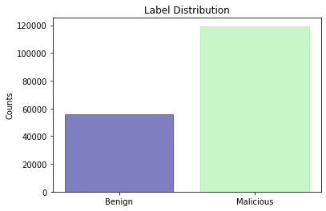


## String Data

Machine learning algorithms need to be feed with specific data types in order to work. String data must be transformed. In the UNSW-NB 15 dataset, there are three categorical columns. There are two approaches when dealing with categorical data. One can either one hot or ordinal encode. In the case of one hot encoding, the column being encoding is transformed to N number of binary columns. N represents the number of unique categories for the column being encoded. A 1 is assigned to the cell of the new column if the row contains the the category the new column represents, otherwise a 0 is assigned. The string column is then removed. This solves the problem for categorical data. However, a new challenge emerges called the curse of dimensionality. The curse of dimensionality occurs when the data is sparse and commonly the number of data required to have a reliable results grows exponentially. On the other hand, if the data contains an order then the text data can be updated to integer values.

There are three categorical features we must encode. The features are proto, service, and state.

## Proto

There are 132 different protocols in the proto feature. Below is a list of the top 10. The features below rtp contain only malicious samples. We may run into problems with the curse of dimensionality if we one hot encode 124 features. It is reasonable to group the 124 features into a category called other.

The majority of attacks are either tcp or udp. This makes sense since both protocols are used the most. There is about 10k network access storage attacks and 2.5k open shortest path first attacks. 

| Protocol | Benign Count | Malicious Count |
| ------- |:--------:| -------:|
tcp|39121|40825
udp|13922|49361
unas|0|12084
arp|2859|0
ospf|64|2531
igmp|18|0
icmp|15|0
rtp|1|0
sctp|0|1150
any|0|300

After grouping the features the protocol encoding is:

| Protocol | Benign Count | Malicious Count |
| ------- |:--------:| -------:|
tcp|39121|40825
udp|13922|49361
unas|0|12084
arp|2859|0
ospf|64|2531
igmp|18|0
icmp|15|0
rtp|1|0
other|0|14540

## Service


The `-` defines a not much used service. Half the attacks are from the `-` service. About one third of the attacks are dns related. A common dns attack is known as dns tunneling. In dns tunneling, an attacker packs data into the dns call. In most networks, the dns service is an acceptable service so attackers use that to their advantage. Overall, the service distribution makes sense.

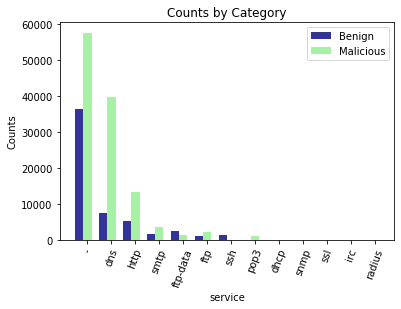


service|benign_count|malicious_count
| ------- |:--------:| -------:|
-|36512|57656
dns|7493|39801
http|5348|13376
smtp|1579|3479
ftp-data|2552|1443
ftp|1218|2210
ssh|1291|11
pop3|4|1101
dhcp|0|94
snmp|1|79
ssl|0|56
irc|0|25
radius|2|10


## State

The state feature indicates the state and its dependent protocol.

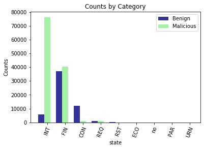

state|benign_count|malicious_count
| ------- |:--------:| -------:|
INT|5715|76560
FIN|37175|40650
CON|12099|1053
REQ|925|1066
RST|71|12
ECO|12|0
no|1|0
PAR|1|0
URN|1|0

## All Features

No.|Name|Type|Description
| ------- |:--------:|:--------:|:----------------------------------------------------------:|
1|srcip|nominal|Source IP address
2|sport|integer|Source port number
3|dstip|nominal|Destination IP address
4|dsport|integer|Destination port number
5|proto|nominal|Transaction protocol
6|state|nominal|"Indicates to the state and its dependent protocol, e.g. ACC, CLO, CON, ECO, ECR, FIN, INT, MAS, PAR, REQ, RST, TST, TXD, URH, URN, and (-) (if not used state)"
7|dur|Float|Record total duration
8|sbytes|Integer|Source to destination transaction bytes 
9|dbytes|Integer|Destination to source transaction bytes
10|sttl|Integer|Source to destination time to live value 
11|dttl|Integer|Destination to source time to live value
12|sloss|Integer|Source packets retransmitted or dropped 
13|dloss|Integer|Destination packets retransmitted or dropped
14|service|nominal|"http, ftp, smtp, ssh, dns, ftp-data ,irc  and (-) if not much used service"
15|Sload|Float|Source bits per second
16|Dload|Float|Destination bits per second
17|Spkts|integer|Source to destination packet count 
18|Dpkts|integer|Destination to source packet count
19|swin|integer|Source TCP window advertisement value
20|dwin|integer|Destination TCP window advertisement value
21|stcpb|integer|Source TCP base sequence number
22|dtcpb|integer|Destination TCP base sequence number
23|smeansz|integer|Mean of the ?ow packet size transmitted by the src 
24|dmeansz|integer|Mean of the ?ow packet size transmitted by the dst 
25|trans_depth|integer|Represents the pipelined depth into the connection of http request/response transaction
26|res_bdy_len|integer|Actual uncompressed content size of the data transferred from the server�s http service.
27|Sjit|Float|Source jitter (mSec)
28|Djit|Float|Destination jitter (mSec)
29|Stime|Timestamp|record start time
30|Ltime|Timestamp|record last time
31|Sintpkt|Float|Source interpacket arrival time (mSec)
32|Dintpkt|Float|Destination interpacket arrival time (mSec)
33|tcprtt|Float|"TCP connection setup round-trip time, the sum of �synack� and �ackdat�."
34|synack|Float|"TCP connection setup time, the time between the SYN and the SYN_ACK packets."
35|ackdat|Float|"TCP connection setup time, the time between the SYN_ACK and the ACK packets."
36|is_sm_ips_ports|Binary|"If source (1) and destination (3)IP addresses equal and port numbers (2)(4)  equal then, this variable takes value 1 else 0"
37|ct_state_ttl|Integer|No. for each state (6) according to specific range of values for source/destination time to live (10) (11).
38|ct_flw_http_mthd|Integer|No. of flows that has methods such as Get and Post in http service.
39|is_ftp_login|Binary|If the ftp session is accessed by user and password then 1 else 0. 
40|ct_ftp_cmd|integer|No of flows that has a command in ftp session.
41|ct_srv_src|integer|No. of connections that contain the same service (14) and source address (1) in 100 connections according to the last time (26).
42|ct_srv_dst|integer|No. of connections that contain the same service (14) and destination address (3) in 100 connections according to the last time (26).
43|ct_dst_ltm|integer|No. of connections of the same destination address (3) in 100 connections according to the last time (26).
44|ct_src_|ltm|integer,No. of connections of the same source address (1) in 100 connections according to the last time (26).
45|ct_src_dport_ltm|integer|No of connections of the same source address (1) and the destination port (4) in 100 connections according to the last time (26).
46|ct_dst_sport_ltm|integer|No of connections of the same destination address (3) and the source port (2) in 100 connections according to the last time (26).
47|ct_dst_src_ltm|integer|No of connections of the same source (1) and the destination (3) address in in 100 connections according to the last time (26).
48|attack_cat|nominal|"The name of each attack category. In this data set , nine categories e.g. Fuzzers, Analysis, Backdoors, DoS Exploits, Generic, Reconnaissance, Shellcode and Worms"
49|Label|binary|0 for normal and 1 for attack records

attack_cat is dropped. One can use attack category to verify training on a clustering algorithm such as k-means.

# Preprocess
Looking at the data file I noticed the samples are ordered by label. We will want to shuffle the training data before we train.

Run the code in the [preprocess](preprocess.py) file. 

The code:

* cleans the proto column
* one hot encodes the proto, service, and state column
* minmax scales the data and saves it
* transforms data with PCA and saves it
* plots the principle components
* 2d plots the first 2 principle components
* 3d plots the first 3 principle components

# Dimensonality Reduction

## Principle Components

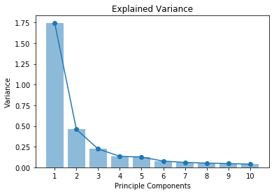

## First 2 Principle Components
The benign and malicious features are not linearly separable in 2D. There are visible overlaps in quadrant 3 and 4. Quadrant 1 and 2 look to have more malicious samples than benign. 

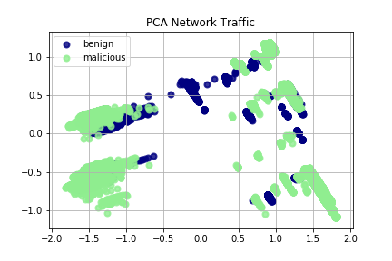

### Benign Only
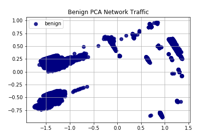

### Malicious Only
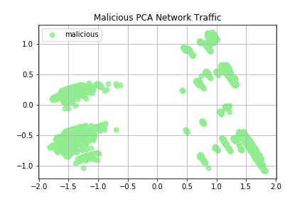


## First 3 Principle Components
The benign and malicious features are not linearly separable in 3D. However, the cluster shapes appear different. 

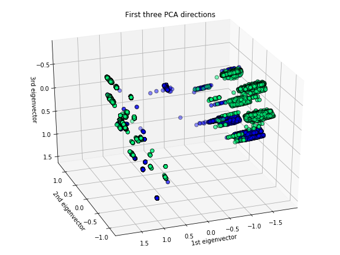

### Benign Only

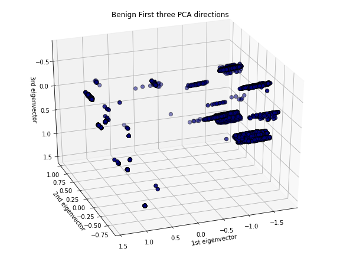

### Malicious Only

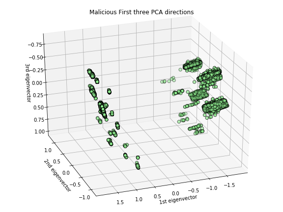

# Training

In this section we train a model with the scaled dataset and the PCA transformed dataset.

## Environment Setup

```
$ conda create -n tf2 python=3.6 pip
$ conda activate tf2
$ conda uninstall tensorflow-gpu
$ pip install tensorflow-gpu==2.0.0-beta1
$ conda install pandas numpy joblib matplotlib
```

Verify the install was successful.

```
python
>>> import tensorflow as tf
>>> from tensorflow import keras
>>> tf.__version__
'2.0.0'
>>> keras.__version__
'2.2.4-tf'
```

### Note: 
If you see this error `ImportError: Could not find 'cudart64_100.dll'. TensorFlow requires that this DLL be installed in a directory that is named in your %PATH% environment variable. Download and install CUDA 10.0 from this URL: https://developer.nvidia.com/cuda-90-download-archive`, follow the instructions and install the DLL.

The link will take you to the CUDA 9.0 archive. You really need to go to the CUDA 10.0 archive and install the toolkit. Also, you will need to download the cudnn binaries from nvidia as well.

Follow the [software requirements](https://www.tensorflow.org/install/gpu#software_requirements) bullet points.


## Benchmark

In the paper `The evaluation of Network Anomaly Detection Systems: Statistical analysis of the UNSW-NB15 data set and the comparison with the KDD99 data set`, the researchers obtained `81.34%` accuracy for their neural network model. Similar results were achieved using a neural network in the experiment documented below. The purpose of this experiment was to visualize the difference in training after transforming a dataset with PCA. Extra time was not spent tweaking the hyperparameters to improve learning accuracy.


## MinMax Scaled | 70 Features | 10 epochs 

The baseline     model obtained a `91.23%` training accuracy and a `80.82%` test accuracy. Two dropout layers were added to help reduce overfitting. The model converges on the 7<sup>th</sup> epoch. Epochs 8, 9 and 10 the training accuracy is slightly improving while the testing accuracy is staying constant. This is a sign of overfitting the model to the training dataset.


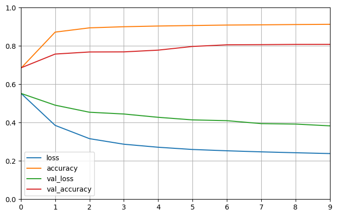

```
$ python training.py
Train on 175341 samples, validate on 82332 samples
Epoch 1/10
175341/175341 [==============================] - 31s 174us/sample - loss: 0.5537 - accuracy: 0.6829 - val_loss: 0.5526 - val_accuracy: 0.6852
Epoch 2/10
175341/175341 [==============================] - 30s 170us/sample - loss: 0.3854 - accuracy: 0.8721 - val_loss: 0.4908 - val_accuracy: 0.7576
Epoch 3/10
175341/175341 [==============================] - 30s 173us/sample - loss: 0.3160 - accuracy: 0.8944 - val_loss: 0.4540 - val_accuracy: 0.7684
Epoch 4/10
175341/175341 [==============================] - 30s 171us/sample - loss: 0.2870 - accuracy: 0.9002 - val_loss: 0.4447 - val_accuracy: 0.7689
Epoch 5/10
175341/175341 [==============================] - 30s 172us/sample - loss: 0.2712 - accuracy: 0.9039 - val_loss: 0.4275 - val_accuracy: 0.7780
Epoch 6/10
175341/175341 [==============================] - 30s 169us/sample - loss: 0.2596 - accuracy: 0.9064 - val_loss: 0.4139 - val_accuracy: 0.7973
Epoch 7/10
175341/175341 [==============================] - 30s 171us/sample - loss: 0.2528 - accuracy: 0.9089 - val_loss: 0.4099 - val_accuracy: 0.8058
Epoch 8/10
175341/175341 [==============================] - 31s 174us/sample - loss: 0.2472 - accuracy: 0.9101 - val_loss: 0.3946 - val_accuracy: 0.8066
Epoch 9/10
175341/175341 [==============================] - 30s 172us/sample - loss: 0.2425 - accuracy: 0.9117 - val_loss: 0.3921 - val_accuracy: 0.8080
Epoch 10/10
175341/175341 [==============================] - 30s 169us/sample - loss: 0.2383 - accuracy: 0.9128 - val_loss: 0.3829 - val_accuracy: 0.8082
```

```
$ model.summary()
Model: "sequential"
_________________________________________________________________
Layer (type)                 Output Shape              Param #   
=================================================================
dense (Dense)                (None, 70)                4970      
_________________________________________________________________
dropout (Dropout)            (None, 70)                0         
_________________________________________________________________
dense_1 (Dense)              (None, 35)                2485      
_________________________________________________________________
dropout_1 (Dropout)          (None, 35)                0         
_________________________________________________________________
dense_2 (Dense)              (None, 1)                 36        
=================================================================
Total params: 7,491
Trainable params: 7,491
Non-trainable params: 0
_________________________________________________________________
```

## MinMax Scaled PCA Transformed | 5 Features | 10 Epochs

The model never converges when training with the first 5 features of the PCA transformed dataset. This is most likely due to the fact the first 5 features do not contain enough information for the model to distinguish between a benign and malicious sample. In addition, there are only 45 weight and bias parameters the model can tune. Tweaking the number of hidden layers could improve the models performance.

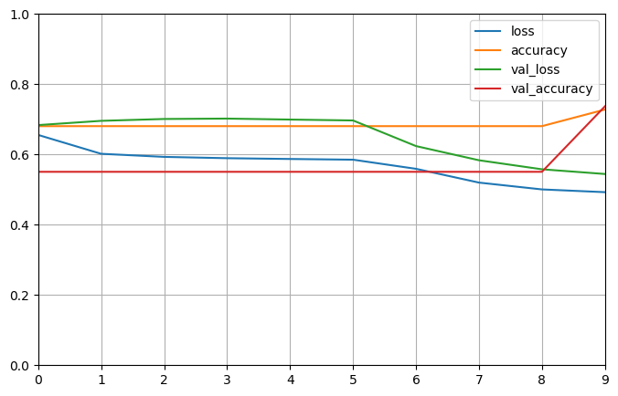

```
$ python training.py

... removed minmax scaled run ...

PCA training with 5 features.
Train on 175341 samples, validate on 82332 samples
Epoch 1/10
175341/175341 [==============================] - 37s 211us/sample - loss: 0.6556 - accuracy: 0.6805 - val_loss: 0.6836 - val_accuracy: 0.5506
Epoch 2/10
175341/175341 [==============================] - 29s 163us/sample - loss: 0.6019 - accuracy: 0.6806 - val_loss: 0.6957 - val_accuracy: 0.5506
Epoch 3/10
175341/175341 [==============================] - 29s 163us/sample - loss: 0.5931 - accuracy: 0.6806 - val_loss: 0.7010 - val_accuracy: 0.5506
Epoch 4/10
175341/175341 [==============================] - 29s 163us/sample - loss: 0.5894 - accuracy: 0.6806 - val_loss: 0.7021 - val_accuracy: 0.5506
Epoch 5/10
175341/175341 [==============================] - 29s 164us/sample - loss: 0.5871 - accuracy: 0.6806 - val_loss: 0.6993 - val_accuracy: 0.5506
Epoch 6/10
175341/175341 [==============================] - 29s 166us/sample - loss: 0.5851 - accuracy: 0.6806 - val_loss: 0.6968 - val_accuracy: 0.5506
Epoch 7/10
175341/175341 [==============================] - 30s 168us/sample - loss: 0.5591 - accuracy: 0.6806 - val_loss: 0.6238 - val_accuracy: 0.5506
Epoch 8/10
175341/175341 [==============================] - 29s 167us/sample - loss: 0.5199 - accuracy: 0.6806 - val_loss: 0.5835 - val_accuracy: 0.5506
Epoch 9/10
175341/175341 [==============================] - 28s 161us/sample - loss: 0.5005 - accuracy: 0.6806 - val_loss: 0.5578 - val_accuracy: 0.5506
Epoch 10/10
175341/175341 [==============================] - 28s 161us/sample - loss: 0.4926 - accuracy: 0.7279 - val_loss: 0.5444 - val_accuracy: 0.7370
```

```
$ model.summary()

Model: "sequential"
_________________________________________________________________
Layer (type)                 Output Shape              Param #
=================================================================
dense (Dense)                (None, 5)                 30
_________________________________________________________________
dropout (Dropout)            (None, 5)                 0
_________________________________________________________________
dense_1 (Dense)              (None, 2)                 12
_________________________________________________________________
dropout_1 (Dropout)          (None, 2)                 0
_________________________________________________________________
dense_2 (Dense)              (None, 1)                 3
=================================================================
Total params: 45
Trainable params: 45
Non-trainable params: 0
_________________________________________________________________
```

## MinMax Scaled PCA Transformed | 10 Features | 10 Epochs

The model obtained a `86.79%` training accuracy and a `78.50%` test accuracy. The model converges at the 5<sup>th</sup> epoch. The model does better than the model trained with 5 features. This model does not beat the baseline model with 70 features. However, what is interesting is the difference between the training accuracy and the testing accuracy is less when using the PCA transformed dataset and 10 features than when using the minmax dataset and 70 features.

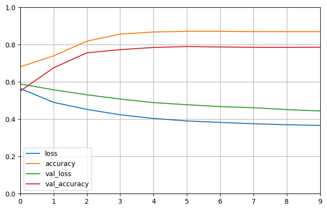

```
$ python training.py

... removed previous runs ...

PCA training with 10 features.
Train on 175341 samples, validate on 82332 samples
Epoch 1/10
175341/175341 [==============================] - 30s 172us/sample - loss: 0.5651 - accuracy: 0.6806 - val_loss: 0.5889 - val_accuracy: 0.5506
Epoch 2/10
175341/175341 [==============================] - 30s 169us/sample - loss: 0.4903 - accuracy: 0.7398 - val_loss: 0.5577 - val_accuracy: 0.6754
Epoch 3/10
175341/175341 [==============================] - 30s 169us/sample - loss: 0.4526 - accuracy: 0.8187 - val_loss: 0.5310 - val_accuracy: 0.7560
Epoch 4/10
175341/175341 [==============================] - 30s 169us/sample - loss: 0.4235 - accuracy: 0.8567 - val_loss: 0.5080 - val_accuracy: 0.7731
Epoch 5/10
175341/175341 [==============================] - 30s 169us/sample - loss: 0.4039 - accuracy: 0.8679 - val_loss: 0.4889 - val_accuracy: 0.7850
Epoch 6/10
175341/175341 [==============================] - 30s 168us/sample - loss: 0.3904 - accuracy: 0.8715 - val_loss: 0.4776 - val_accuracy: 0.7899
Epoch 7/10
175341/175341 [==============================] - 30s 169us/sample - loss: 0.3824 - accuracy: 0.8713 - val_loss: 0.4675 - val_accuracy: 0.7875
Epoch 8/10
175341/175341 [==============================] - 30s 170us/sample - loss: 0.3755 - accuracy: 0.8701 - val_loss: 0.4615 - val_accuracy: 0.7857
Epoch 9/10
175341/175341 [==============================] - 30s 168us/sample - loss: 0.3702 - accuracy: 0.8699 - val_loss: 0.4514 - val_accuracy: 0.7853
Epoch 10/10
175341/175341 [==============================] - 30s 170us/sample - loss: 0.3665 - accuracy: 0.8697 - val_loss: 0.4441 - val_accuracy: 0.7863
```

```
$ model.summary()

Model: "sequential_1"
_________________________________________________________________
Layer (type)                 Output Shape              Param #
=================================================================
dense_3 (Dense)              (None, 10)                110
_________________________________________________________________
dropout_2 (Dropout)          (None, 10)                0
_________________________________________________________________
dense_4 (Dense)              (None, 5)                 55
_________________________________________________________________
dropout_3 (Dropout)          (None, 5)                 0
_________________________________________________________________
dense_5 (Dense)              (None, 1)                 6
=================================================================
Total params: 171
Trainable params: 171
Non-trainable params: 0
_________________________________________________________________
```


## MinMax Scaled PCA Transformed | 20 Features | 10 Epochs

The model obtained a `89.34%` training accuracy and a `78.82%` test accuracy. The model converges at the 5<sup>th</sup> epoch. These are very similar results to the previous model. The training accuracy is ~3% higher while the testing accuracy is roughly the same.


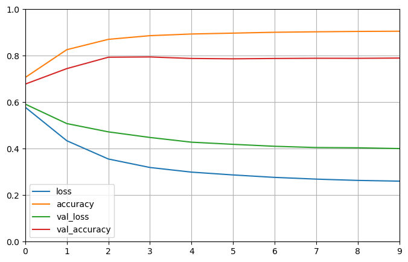

```
$ python training.py

... removed previous runs ...

PCA training with 20 features.
Train on 175341 samples, validate on 82332 samples
Epoch 1/10
175341/175341 [==============================] - 32s 185us/sample - loss: 0.5785 - accuracy: 0.7062 - val_loss: 0.5919 - val_accuracy: 0.6777
Epoch 2/10
175341/175341 [==============================] - 30s 173us/sample - loss: 0.4343 - accuracy: 0.8258 - val_loss: 0.5080 - val_accuracy: 0.7444
Epoch 3/10
175341/175341 [==============================] - 30s 168us/sample - loss: 0.3556 - accuracy: 0.8704 - val_loss: 0.4724 - val_accuracy: 0.7935
Epoch 4/10
175341/175341 [==============================] - 30s 168us/sample - loss: 0.3191 - accuracy: 0.8862 - val_loss: 0.4482 - val_accuracy: 0.7946
Epoch 5/10
175341/175341 [==============================] - 30s 170us/sample - loss: 0.2991 - accuracy: 0.8934 - val_loss: 0.4279 - val_accuracy: 0.7882
Epoch 6/10
175341/175341 [==============================] - 30s 171us/sample - loss: 0.2870 - accuracy: 0.8972 - val_loss: 0.4187 - val_accuracy: 0.7867
Epoch 7/10
175341/175341 [==============================] - 29s 168us/sample - loss: 0.2765 - accuracy: 0.9009 - val_loss: 0.4103 - val_accuracy: 0.7881
Epoch 8/10
175341/175341 [==============================] - 29s 168us/sample - loss: 0.2690 - accuracy: 0.9029 - val_loss: 0.4049 - val_accuracy: 0.7890
Epoch 9/10
175341/175341 [==============================] - 30s 168us/sample - loss: 0.2635 - accuracy: 0.9045 - val_loss: 0.4037 - val_accuracy: 0.7888
Epoch 10/10
175341/175341 [==============================] - 29s 168us/sample - loss: 0.2603 - accuracy: 0.9053 - val_loss: 0.4005 - val_accuracy: 0.7899
```

```
$ model.summary()

Model: "sequential_2"
_________________________________________________________________
Layer (type)                 Output Shape              Param #
=================================================================
dense_6 (Dense)              (None, 20)                420
_________________________________________________________________
dropout_4 (Dropout)          (None, 20)                0
_________________________________________________________________
dense_7 (Dense)              (None, 10)                210
_________________________________________________________________
dropout_5 (Dropout)          (None, 10)                0
_________________________________________________________________
dense_8 (Dense)              (None, 1)                 11
=================================================================
Total params: 641
Trainable params: 641
Non-trainable params: 0
_________________________________________________________________
```

## MinMax Scaled PCA Transformed | 70 Features | 10 Epochs
Training accuracy was `91.19%` and testing accuracy was `80.80%`. These results are very similar to the baseline model.

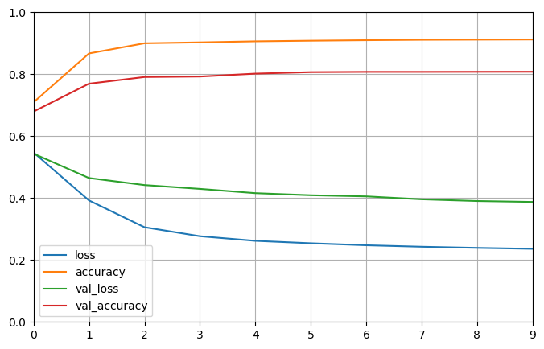


```
$ python training.py

... removed previous runs ...

PCA training with 70 features.

Train on 175341 samples, validate on 82332 samples
Epoch 1/10
175341/175341 [==============================] - 32s 181us/sample - loss: 0.5471 - accuracy: 0.7093 - val_loss: 0.5433 - val_accuracy: 0.6793
Epoch 2/10
175341/175341 [==============================] - 30s 171us/sample - loss: 0.3922 - accuracy: 0.8671 - val_loss: 0.4646 - val_accuracy: 0.7694
Epoch 3/10
175341/175341 [==============================] - 30s 172us/sample - loss: 0.3058 - accuracy: 0.8998 - val_loss: 0.4418 - val_accuracy: 0.7909
Epoch 4/10
175341/175341 [==============================] - 30s 172us/sample - loss: 0.2768 - accuracy: 0.9026 - val_loss: 0.4295 - val_accuracy: 0.7925
Epoch 5/10
175341/175341 [==============================] - 31s 178us/sample - loss: 0.2619 - accuracy: 0.9061 - val_loss: 0.4158 - val_accuracy: 0.8018
Epoch 6/10
175341/175341 [==============================] - 30s 174us/sample - loss: 0.2540 - accuracy: 0.9081 - val_loss: 0.4090 - val_accuracy: 0.8067
Epoch 7/10
175341/175341 [==============================] - 30s 172us/sample - loss: 0.2475 - accuracy: 0.9097 - val_loss: 0.4053 - val_accuracy: 0.8075
Epoch 8/10
175341/175341 [==============================] - 30s 172us/sample - loss: 0.2428 - accuracy: 0.9110 - val_loss: 0.3958 - val_accuracy: 0.8075
Epoch 9/10
175341/175341 [==============================] - 30s 172us/sample - loss: 0.2391 - accuracy: 0.9115 - val_loss: 0.3903 - val_accuracy: 0.8078
Epoch 10/10
175341/175341 [==============================] - 30s 172us/sample - loss: 0.2360 - accuracy: 0.9119 - val_loss: 0.3874 - val_accuracy: 0.8080
```

```
$ model.summary()

Model: "sequential"
_________________________________________________________________
Layer (type)                 Output Shape              Param #
=================================================================
dense (Dense)                (None, 70)                4970
_________________________________________________________________
dropout (Dropout)            (None, 70)                0
_________________________________________________________________
dense_1 (Dense)              (None, 35)                2485
_________________________________________________________________
dropout_1 (Dropout)          (None, 35)                0
_________________________________________________________________
dense_2 (Dense)              (None, 1)                 36
=================================================================
Total params: 7,491
Trainable params: 7,491
Non-trainable params: 0
_________________________________________________________________
```


# Learning Analysis

Although PCA did not improve the accuracy from the benchmark, less data was required to obtain similar accuracies. FAR% (False Alarm Rate) was not tested in this experiment. It would be interesting to see the FAR% for the model trained using the PCA transformed dataset with 10 features. This model seemed to generalize better based on the training and testing accuracies.